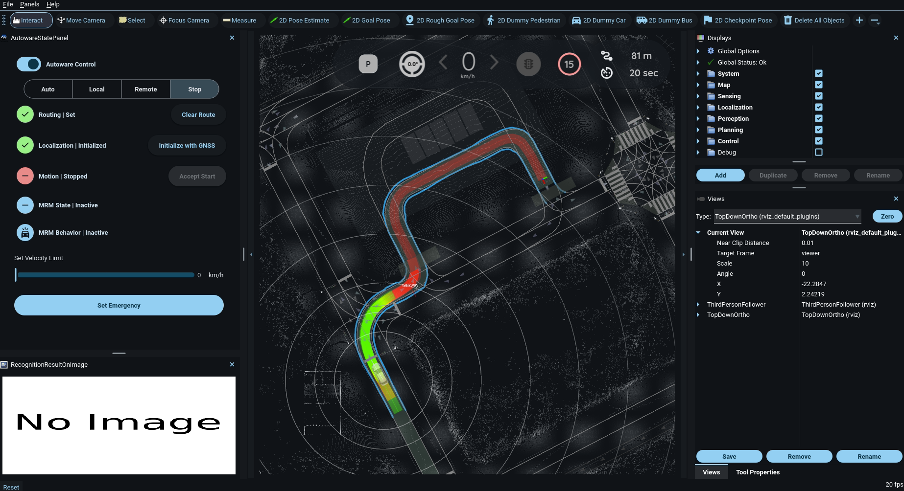

# twizy-hil
Repo includes scripts to launch vehicle interface and/or run HIL (Hardware in the Loop)

**Prerequsites**: Follow all steps up to step 10 of [these notion docs](https://www.notion.so/monashcav/Running-HIL-cdd7e7b4e40f4a82aa159b362434f809)

### Launch Vehicle Interface
Run `first.sh` and provide path to vehicle interface ros workspace (if none provided, it defaults to `~/test_sd/ack_ws`)
1. Open run `first.sh` on one terminal (SSH or Anydesk)
```bash
./first.sh # defaults to ~/test_sd/ack_ws
```
or 
```bash
./first.sh ~/path_to_ros_ws
```

### Launch Planning Simulation GUI (and perform HIL)
1. Follow *Launch Vehicle Interface* instructions
2. Run `second.sh` on another terminal and (optional) providing path to autoware workspace (if none provided, it defaults to `~/sept_autoware_dir/autoware`)
3. Follow the remaining of [the notion docs](https://www.notion.so/monashcav/Running-HIL-cdd7e7b4e40f4a82aa159b362434f809) (steps 11 to end)



#### Common Issue
If the RViz "Auto" button is unclickable, then you may need to quit and re-run `second.sh`