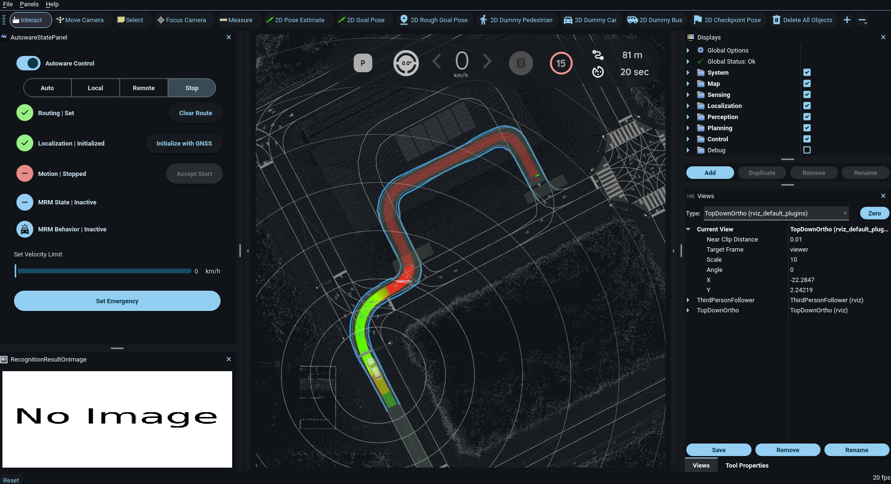

# twizy-hil
Repo includes scripts to launch vehicle interface and/or run HIL (Hardware in the Loop)

**Prerequsites**: Follow all steps up to step 10 of [these notion docs](https://www.notion.so/monashcav/Running-HIL-cdd7e7b4e40f4a82aa159b362434f809)

### Launch Vehicle Interface
Use the unified `twizy.sh` entrypoint. This prepares and launches the SD Vehicle Interface for the Twizy.

1. (First time only per workspace) run setup:

```bash
./twizy.sh setup               # uses default workspace
```

2. In a terminal (SSH or Anydesk), launch the vehicle interface:

```bash
./twizy.sh interface
```
or 
```bash
./first.sh                     # optional workspace argument still supported
```

### Launch Controller
2. In another terminal, launch the controller:

```bash
./twizy.sh controller
```

or

```bash
./second.sh                    # optional workspace argument still supported
```

### Testing different SD-VehicleInterface branches

Switch your `SD-VehicleInterface` repo branch quickly:

```bash
./twizy.sh branch-test <branchname>
```

## Launch Legacy Autoware Planning Simulator GUI
- `autowareSimulation.sh`
- [the notion docs](https://www.notion.so/monashcav/Running-HIL-cdd7e7b4e40f4a82aa159b362434f809)
   (steps 11 to end).


#### Common Issue
If the RViz "Auto" button is unclickable, then you may need to quit and re-run `second.sh`